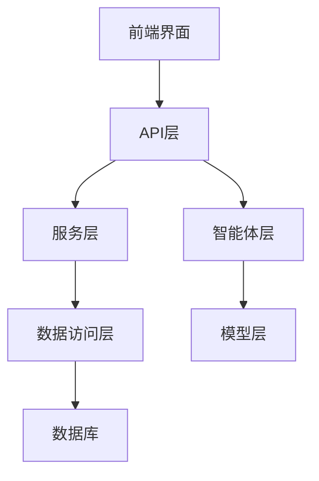

# 系统架构文档

## 整体架构

FastAPI智能体聊天应用采用了分层架构设计，主要包括以下几层：



## 核心组件

### 1. API层 (app_agent.py)

API层负责处理HTTP请求和响应，包括：
- 会话管理API
- 消息管理API
- 兼容旧API

### 2. 服务层 (services.py)

服务层负责实现业务逻辑，包括：
- ChatSessionService：处理会话相关操作
- ChatMessageService：处理消息相关操作

### 3. 数据访问层 (models.py, database.py)

数据访问层负责与数据库交互，包括：
- 数据模型定义
- 数据库连接配置
- 数据库会话管理

### 4. 智能体层 (app_agent.py中的get_agent函数)

智能体层负责创建和管理智能体，包括：
- 创建智能体
- 加载智能体状态
- 处理用户消息
- 保存智能体状态

### 5. 模型层 (model_config.yaml)

模型层负责配置和调用大语言模型，包括：
- 模型配置
- 模型调用

## 技术栈

- **Web框架**：FastAPI
- **ORM**：SQLAlchemy 2.0
- **数据库**：PostgreSQL
- **迁移工具**：Alembic
- **异步支持**：asyncpg, async/await
- **智能体框架**：AutoGen
- **大语言模型**：通过model_config.yaml配置

## 代码组织

```
agentchat_fastapi/
├── alembic/                  # 数据库迁移
│   ├── versions/             # 迁移脚本
│   ├── env.py                # 迁移环境配置
│   └── script.py.mako        # 迁移脚本模板
├── docs/                     # 文档
├── app_agent.py              # 主应用入口
├── app_agent.html            # 前端界面
├── database.py               # 数据库配置
├── models.py                 # 数据模型
├── services.py               # 服务层
├── model_config.yaml         # 模型配置
└── .env                      # 环境变量
```

## 扩展性设计

系统设计考虑了以下扩展性因素：

1. **模块化设计**：各组件职责明确，便于扩展和替换
2. **服务层抽象**：业务逻辑封装在服务层，便于添加新功能
3. **数据库迁移**：使用Alembic管理数据库变更，便于架构演进
4. **兼容性保持**：保留原有API，确保向后兼容

## 未来扩展方向

1. **用户认证**：添加用户认证和授权机制
2. **多模型支持**：支持在不同会话中使用不同的模型
3. **会话模板**：支持预定义会话模板
4. **数据分析**：添加对话数据分析功能
5. **WebSocket支持**：添加WebSocket支持，实现实时通信
