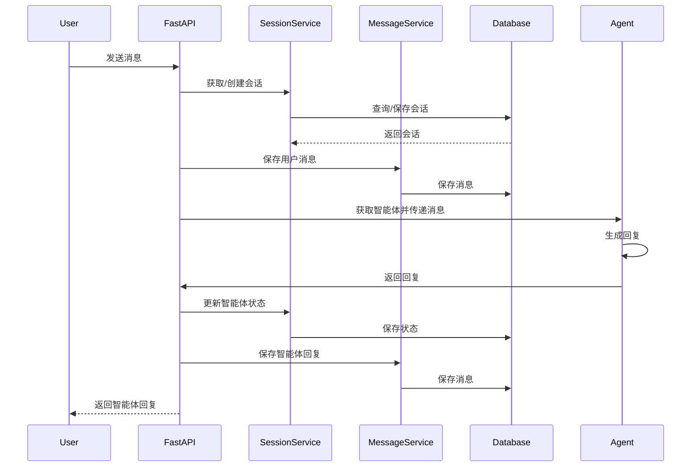

# 数据流程文档

## 系统数据流程

本应用的数据流程展示了用户消息如何通过系统各个组件进行处理，最终返回智能体的回复。

## 详细流程说明

### 1. 用户发送消息

用户通过前端界面或API发送消息到服务器。

### 2. 获取或创建会话

系统根据请求中的会话ID获取会话，如果没有提供会话ID或会话不存在，则创建新会话。

### 3. 保存用户消息

系统将用户消息保存到数据库中，关联到对应的会话。如果是会话的第一条消息，系统会自动根据消息内容生成会话名称。

### 4. 获取智能体并传递消息

系统获取智能体，如果会话中有智能体状态，则加载状态。然后将用户消息传递给智能体。

### 5. 智能体生成回复

智能体处理用户消息并生成回复，包括回复内容和可能的思考过程（thought字段）。

### 6. 更新智能体状态

系统保存智能体的最新状态到数据库中，关联到对应的会话。

### 7. 保存智能体回复

系统将智能体的回复（包括thought字段）保存到数据库中，关联到对应的会话。

### 8. 返回回复给用户

系统将智能体的回复返回给用户。

## 数据持久化

### 数据库存储策略

本应用采用纯数据库存储策略，完全弃用JSON文件存储方式，具有以下优势：

1. **数据一致性**：所有数据都存储在数据库中，避免了多种存储方式之间的同步问题
2. **事务支持**：数据库提供事务支持，确保数据操作的原子性
3. **并发处理**：数据库能够更好地处理并发请求
4. **查询效率**：可以高效执行复杂查询，如按时间范围查询消息
5. **数据备份**：数据库提供更完善的备份和恢复机制

### 会话状态持久化

会话状态包括智能体的状态信息，存储在`ChatSession`表的`agent_state`字段中。这使得智能体可以在多次交互之间保持上下文。

### 消息历史持久化

所有的消息历史记录存储在`ChatMessage`表中，关联到对应的会话。消息包含以下关键信息：

- **内容**：消息的文本内容
- **来源**：消息的发送者（用户或智能体）
- **类型**：消息的类型
- **思考过程**：智能体的思考过程（仅适用于智能体消息）
- **模型使用情况**：记录模型的使用情况，如token数量
- **元数据**：其他相关信息
