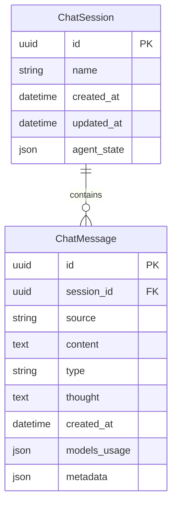

# 数据库设计文档

## 数据库架构

本应用使用PostgreSQL数据库存储会话和消息数据。数据库架构如下：

## 数据模型说明

### ChatSession 模型

会话管理模型，存储会话基本信息和智能体状态。

| 字段名 | 类型 | 说明 |
|-------|------|------|
| id | UUID | 主键，会话唯一标识 |
| name | String | 会话名称 |
| created_at | DateTime | 创建时间 |
| updated_at | DateTime | 更新时间 |
| agent_state | JSON | 智能体状态，存储为JSON格式 |

### ChatMessage 模型

消息模型，存储消息内容、类型、来源等信息。

| 字段名 | 类型 | 说明 |
|-------|------|------|
| id | UUID | 主键，消息唯一标识 |
| session_id | UUID | 外键，关联到ChatSession |
| source | String | 消息来源，如"user"或"assistant" |
| content | Text | 消息内容 |
| type | String | 消息类型，如"TextMessage"、"UserMessage"或"AssistantMessage" |
| thought | Text | 智能体思考过程，仅适用于assistant消息 |
| created_at | DateTime | 创建时间 |
| models_usage | JSON | 模型使用情况，存储为JSON格式 |
| metadata | JSON | 元数据，存储为JSON格式 |

## 数据库迁移

使用Alembic进行数据库迁移管理，迁移脚本位于`alembic/versions/`目录下。

### 迁移脚本

1. **001_initial_migration.py** - 创建初始表结构
   - 创建`chat_sessions`表
   - 创建`chat_messages`表
   - 创建相关索引

2. **002_add_thought_field.py** - 添加thought字段
   - 向`chat_messages`表添加`thought`字段，用于存储智能体的思考过程

## 服务层设计

### ChatSessionService

处理会话相关操作，包括：

- 创建会话
- 获取会话
- 获取最新会话
- 列出会话
- 更新智能体状态
- 删除会话
- 根据消息更新会话名称

### ChatMessageService

处理消息相关操作，包括：

- 创建消息
- 从TextMessage创建消息
- 获取会话消息
- 转换为字典列表
- 转换为TextMessage列表

## 数据存储策略

本应用完全采用数据库存储方式，不再使用JSON文件进行数据存储。这种方式有以下优势：

1. **数据一致性**：避免文件和数据库之间的同步问题
2. **并发支持**：数据库天然支持并发操作
3. **查询效率**：可以高效地执行复杂查询
4. **事务支持**：支持原子操作和事务回滚
5. **扩展性**：便于未来添加更多功能和字段
