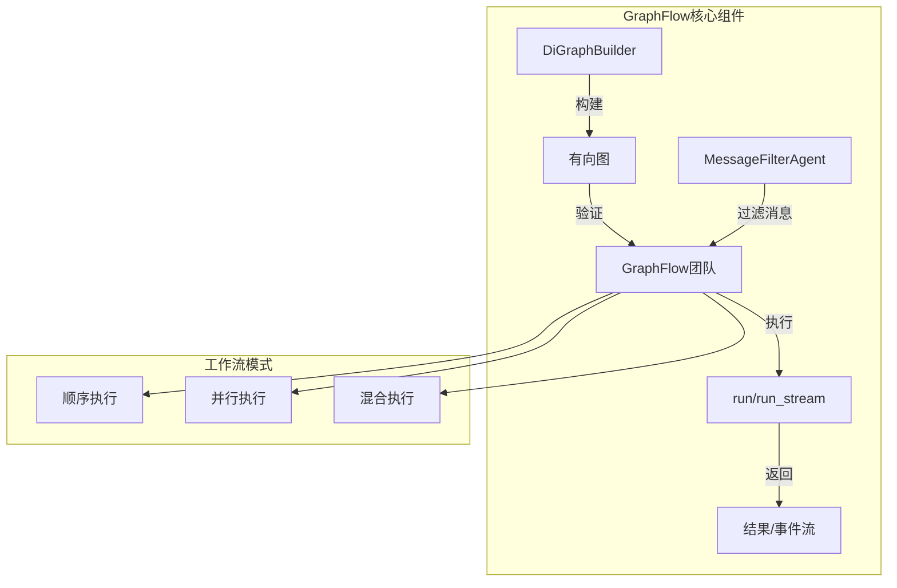
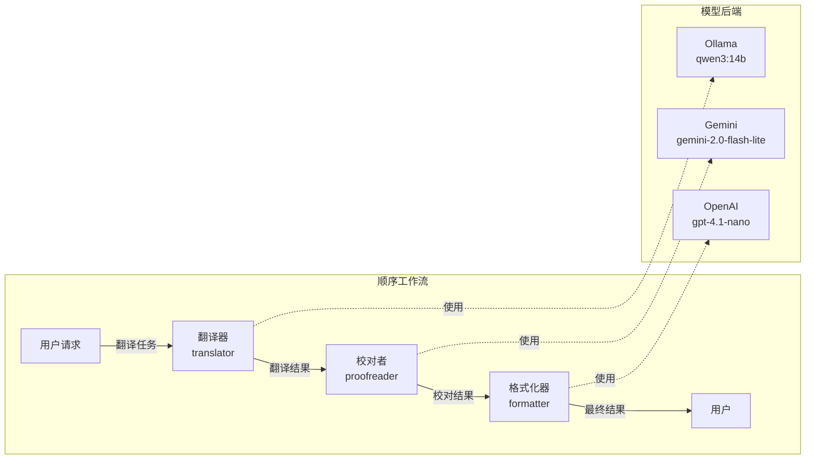
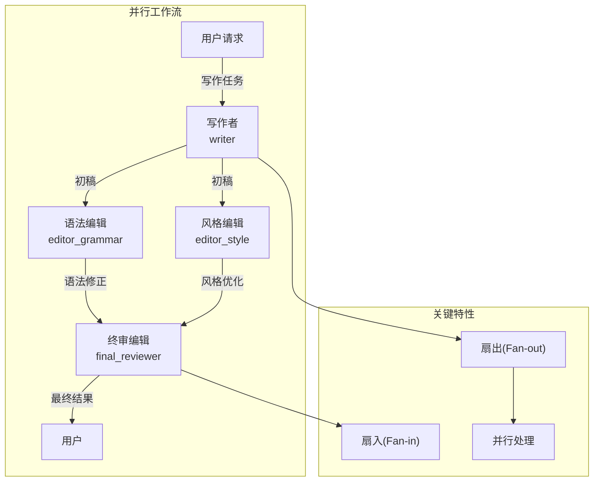
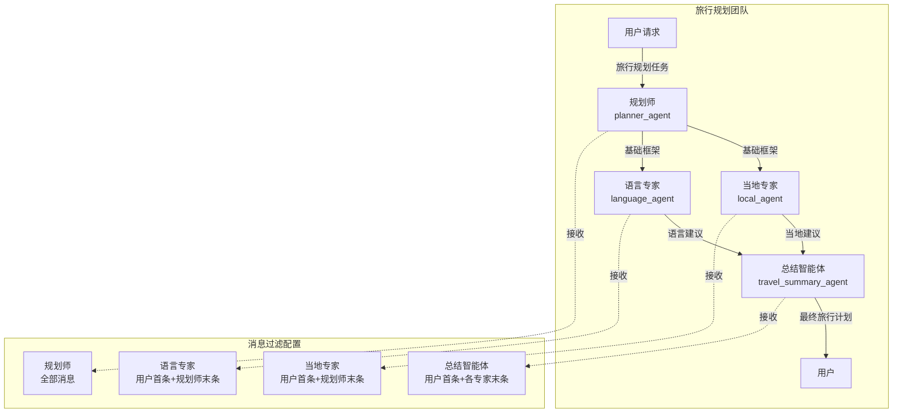
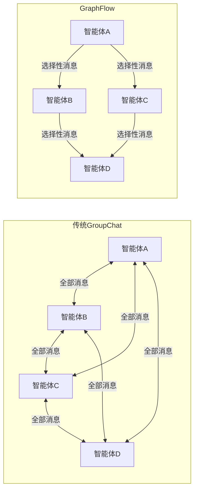
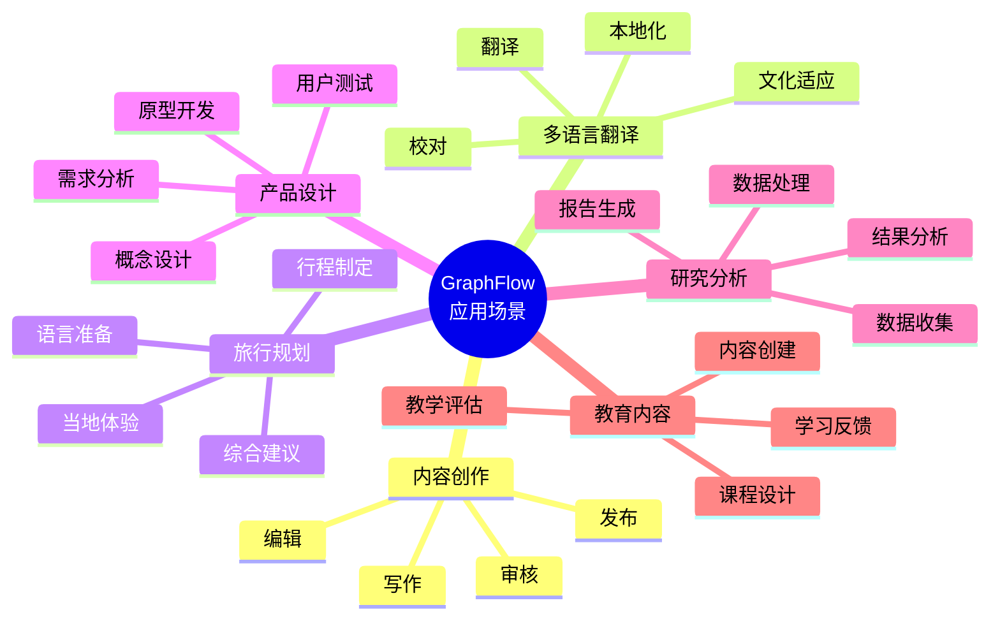
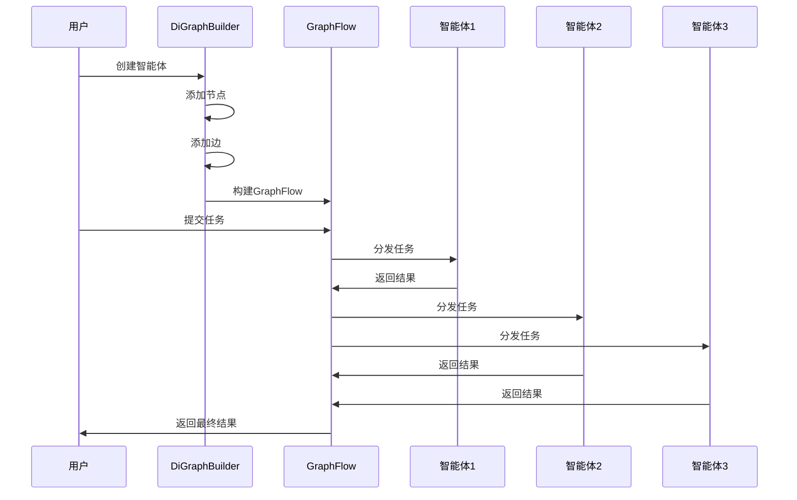

# AutoGen GraphFlow 流程思维导图

## 1. GraphFlow 核心架构

## 2. 顺序工作流 (sequential-flow.py)

## 3. 并行工作流 (parallel-flow.py)

## 4. 旅行规划团队 (travel-agent.py)

## 5. GraphFlow 与传统群聊对比

## 6. GraphFlow 应用场景

## 7. GraphFlow 执行流程

