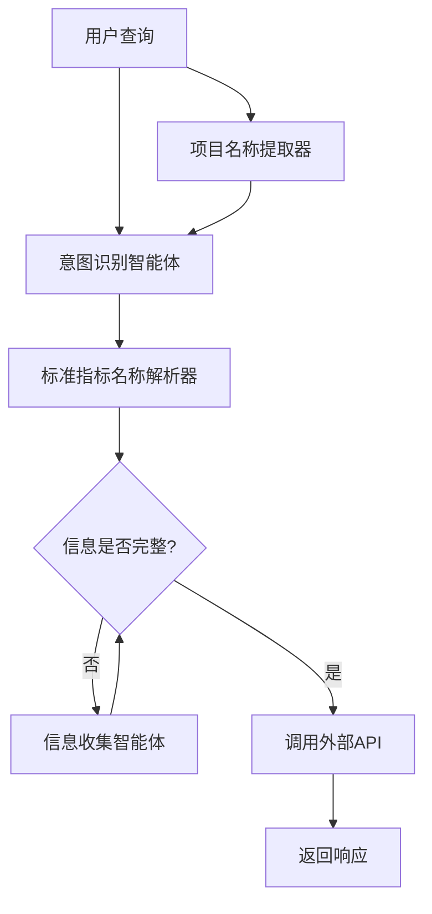

# AutoGen BI 智能体
基于 AutoGen 框架实现的纯粹 BI 查询智能体，专注于多轮对话、意图识别和信息收集功能。

## 🚀 特性
- [x] 多轮对话：支持上下文记忆和连续对话，通过唯一会话 ID 标识
- [x] 意图识别：快速判断用户查询是否为 BI 相关，非相关查询直接跳过
- [x] 信息收集：智能收集缺失的项目、时间和指标信息
- [x] 参数提取：从对话中精准提取关键参数，便于外部 API 调用
- [x] 项目名称提取：基于命名实体识别和规则匹配，提取不含“项目”字样的最小化项目名称
- [x] 标准指标名称解析：基于本地向量数据库，将用户输入的指标名称标准化
- [x] 流式模式：支持流式输出，兼容百炼 API 等只支持流式模式的服务
- [x] 高性能：查询响应时间控制在 2-3 秒内
- [x] 异步支持：提供同步和异步接口，满足不同场景需求
- [x] 兼容性：支持讯飞maas平台、百炼等兼容 OpenAI 接口的服务

## 📋 目录结构
```plaintext
autogenchat_bi/
├── __init__.py
├── core/
│   ├── __init__.py
│   ├── bi_orchestrator.py  # BI 智能体编排器
│   ├── collector_agent.py  # 信息收集智能体
│   └── intent_agent.py     # 意图识别智能体
├── utils/
│   ├── __init__.py
│   ├── date_parser.py      # 日期解析工具
│   ├── project_extractor.py # 项目名称提取工具
│   └── target_extractor.py # 标准指标名称解析器
├── examples/
│   ├── __init__.py
│   ├── async_example.py    # 异步使用示例
│   └── target_extractor_example.py # 标准指标名称解析示例
├── target-docs/            # 标准指标文档目录
├── chroma_db/              # 向量数据库存储目录
└── README.md               # 项目文档
```

## 💡 核心组件
- **BIOrchestrator**：主智能体，协调整个对话流程（在代码中命名为BIAgent）
- **intent_agent**：判断查询意图，提取关键参数
- **collector_agent**：收集缺失信息，完善查询条件
- **DateParser**：解析各种时间表达，支持相对时间
- **ProjectExtractor**：提取项目名称，基于命名实体识别和规则匹配技术
- **TargetExtractor**：标准指标名称解析器，基于本地向量数据库

## 🔧 使用方法
### 基本使用
```python
from autogenchat_bi.core.bi_orchestrator import BIAgent

# 创建 BI 智能体
bi_agent = BIAgent(
    model_config={
        "config_list": [
            {
                "model": "your_model_id",
                "api_key": "your_api_key",
                "base_url": "your_api_base_url",
                "api_type": "openai",
                "extra_body": {"search_disable": False, "show_ref_label": True},
            }
        ],
        "temperature": 0.4,
        "max_tokens": 8192,
        # 流式模式配置
        "use_stream_mode": True,  # 是否启用流式模式，默认为 True
        "print_stream_output": False,  # 是否打印流式输出，默认为 False
    },
    conversation_id="unique_conversation_id"
)

# 同步处理用户查询
result = bi_agent.process_query("华南物业2024年的物业费收缴率是多少？")

# 异步处理用户查询
import asyncio
result = asyncio.run(bi_agent.process_query_async("华南物业2024年的物业费收缴率是多少？"))

# 获取处理结果
print(f"响应: {result['response']}")
if result["is_complete"] and result["extracted_params"]:
    print(f"提取的参数: {result['extracted_params']}")
    print(f"项目: {result['extracted_params'].get('precinctName', '未提供')}")
    print(f"时间: {result['extracted_params'].get('current_date', '未提供')}")
    print(f"指标: {result['extracted_params'].get('targetName', '')}")
```

### 流式模式说明
流式模式是为了支持百炼 API 等只支持流式输出的服务而设计的。在流式模式下，智能体使用 AutoGen 的 `run_stream` 方法而不是 `run` 方法，并使用 `Console` 类处理流式输出。

你可以通过以下方式控制流式模式：

1. 在 `model_config` 中设置 `use_stream_mode` 和 `print_stream_output`
2. 使用命令行参数 `--stream`/`--no-stream` 和 `--print`

## 使用标准指标名称解析器
from autogenchat_bi.utils.target_extractor import TargetExtractor

# 初始化标准指标名称解析器
extractor = TargetExtractor(
    llm_config={
        "config_list": [
            {
                "model": "your_model_id",
                "api_key": "your_api_key",
                "base_url": "your_api_base_url",
                "api_type": "openai",
            }
        ],
        "temperature": 0.0,
        # 流式模式配置
        "use_stream_mode": True,  # 是否启用流式模式，默认为 True
        "print_stream_output": False,  # 是否打印流式输出，默认为 False
    },
    docs_dir="./target-docs",  # 标准指标文档目录
    db_path="./chroma_db",     # 向量数据库存储目录
    cache_size=100,           # 缓存大小，默认 100
    cache_ttl=3600            # 缓存过期时间，默认 3600 秒
)

# 同步提取标准指标名称
target_name = extractor.extract_target("物业费收缴率")
print(f"标准指标名称: {target_name}")

# 异步提取标准指标名称
import asyncio
target_name = asyncio.run(extractor.extract_target_async("物业费收缴率"))
print(f"标准指标名称: {target_name}")

# 使用参数控制缓存和检索
target_name = asyncio.run(extractor.extract_target_async(
    query_text="物业费收缴率",
    top_k=5,               # 检索结果数量，默认 5
    bypass_cache=False     # 是否绕过缓存，默认 False
))
print(f"标准指标名称: {target_name}")

# 强制更新文档集合
extractor.update_collection(force=True)  # 强制重新加载所有文档
```
## 📚 完整示例
运行异步示例程序：

```bash
# 默认模式（流式模式，不打印流式输出）
uv run -m autogenchat_bi.examples.async_example

# 启用流式模式并打印流式输出
uv run -m autogenchat_bi.examples.async_example --stream --print

# 禁用流式模式（如果使用的模型支持非流式模式）
uv run -m autogenchat_bi.examples.async_example --no-stream
```

### 命令行参数

- `--stream`：启用流式模式（默认已启用）
- `--no-stream`：禁用流式模式
- `--print`：打印流式输出（默认不打印）

## 🔧 安装
### 安装依赖
```bash
uv pip install -e .
```
### 或使用 pip
```bash
pip install -e .
```

## 📊 流程图


##  📝 环境变量配置
创建 .env 文件，配置以下环境变量：

# 模型配置
```bash
OPENAI_API_KEY=your_api_key
OPENAI_API_BASE=http://maas-api.cn-huabei-1.xf-yun.com/v1
OPENAI_API_MODEL=xop3qwen30b
```

## 📄 许可证
MIT
