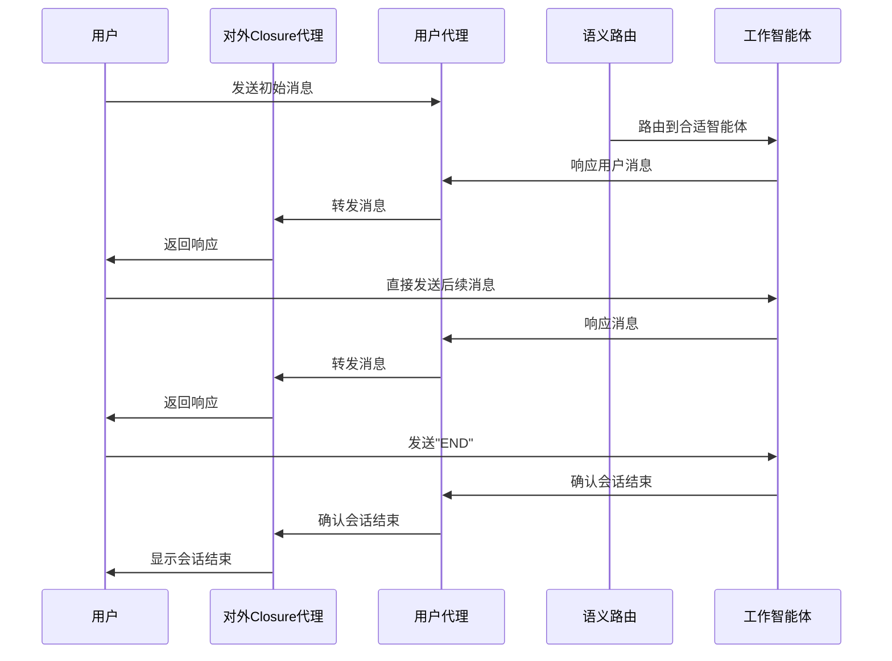

# 分布式多智能体编排与语义路由示例

本仓库展示了如何搭建一个分布式智能体运行时系统，聚焦于多智能体的编排与高效语义路由。

---

## 🏗️ 系统核心组成

1. **Agent Host Runtime（主控运行时）**  
   负责事件引擎与消息发布/订阅系统的统一管理。
2. **Worker Runtime（工作节点运行时）**  
   管理分布式智能体的生命周期，实现“语义路由”能力。
3. **User Proxy（用户代理）**  
   管理用户界面及用户与智能体的交互。

---

## 📋 应用场景示例

以企业 HR 和财务为例：
- 系统中有多个分布式智能体（如“人力资源智能体”、“财务智能体”），每个智能体可独立运行在不同机器上。
- 用户的请求将通过语义路由自动分发给最合适的智能体。
- 本示例强调：企业可高效管理大量专注于不同任务的智能体，无需所有智能体协作解决单一难题，而是针对性地路由请求，实现规模化智能体管理。

---

> 本项目适用于探索分布式智能体架构、企业级智能体调度与路由等场景，欢迎扩展和定制！

系统设计说明：当用户发起会话时，语义路由智能体会识别用户意图（目前采用简单的字符串匹配方式），自动选择最合适的智能体进行路由。之后由该智能体与用户进行持续对话，直到会话结束。

虽然本示例中的智能体逻辑较为简单，核心目的是展示 autogen 分布式运行时对大规模多智能体场景的支持能力。

---

## 🚦 快速上手指南

1. 安装依赖
   ```bash
   pip install autogen-core
   ```

2. 启动分布式运行时（需分别在两个终端运行）：
   ```bash
   # 终端1：主控运行时
   python run_host.py
   ```
   ```bash
   # 终端2：工作节点/语义路由
   python run_semantic_router.py
   ```

3. 在第二个终端输入与“财务”或“人力资源”相关的请求，关键词示例：
   - 财务智能体：`finance`、`money`、`budget`
   - HR智能体：`hr`、`human resources`、`employee`

4. 你将看到主控与工作节点间的消息路由过程，最终由对应智能体返回结果。

5. 会话期间，用户可持续与当前智能体互动，输入 `END` 即可断开会话，重新开始。

---

## 📨 消息流流程图

借助主控运行时的“Topic”机制，系统消息流如下所示：



---

### 贡献者
- Diana Iftimie (@diftimieMSFT)
- Oscar Fimbres (@ofimbres)
- Taylor Rockey (@tarockey)
