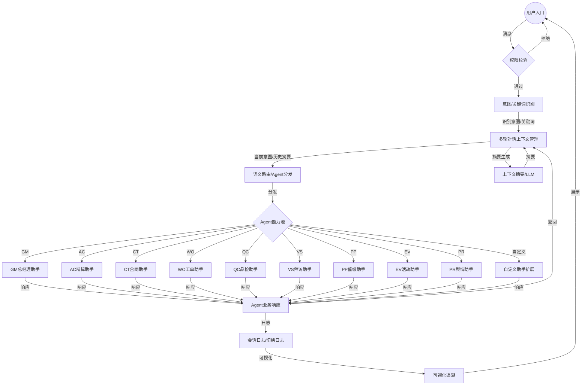

# 物业智能体语义路由系统-全链路流程图（mermaid）

```mermaid
flowchart TD
    用户入口((用户入口))
    权限校验{权限校验}
    意图识别[意图/关键词识别]
    上下文管理[多轮对话上下文管理]
    语义路由[语义路由/Agent分发]
    Agent池{Agent能力池}
    AgentGM[GM总经理助手]
    AgentAC[AC精算助手]
    AgentCT[CT合同助手]
    AgentWO[WO工单助手]
    AgentQC[QC品检助手]
    AgentVS[VS拜访助手]
    AgentPP[PP催缴助手]
    AgentEV[EV活动助手]
    AgentPR[PR舆情助手]
    Agent自定义[自定义助手扩展]
    Agent响应[Agent业务响应]
    摘要生成[上下文摘要/LLM]
    日志记录[会话日志/切换日志]
    可视化[可视化追溯]
    用户入口-->|消息|权限校验
    权限校验-->|通过|意图识别
    权限校验-->|拒绝|用户入口
    意图识别-->|识别意图/关键词|上下文管理
    上下文管理-->|当前意图/历史摘要|语义路由
    语义路由-->|分发|Agent池
    Agent池-->|GM|AgentGM
    Agent池-->|AC|AgentAC
    Agent池-->|CT|AgentCT
    Agent池-->|WO|AgentWO
    Agent池-->|QC|AgentQC
    Agent池-->|VS|AgentVS
    Agent池-->|PP|AgentPP
    Agent池-->|EV|AgentEV
    Agent池-->|PR|AgentPR
    Agent池-->|自定义|Agent自定义
    AgentGM-->|响应|Agent响应
    AgentAC-->|响应|Agent响应
    AgentCT-->|响应|Agent响应
    AgentWO-->|响应|Agent响应
    AgentQC-->|响应|Agent响应
    AgentVS-->|响应|Agent响应
    AgentPP-->|响应|Agent响应
    AgentEV-->|响应|Agent响应
    AgentPR-->|响应|Agent响应
    Agent自定义-->|响应|Agent响应
    Agent响应-->|返回|上下文管理
    Agent响应-->|日志|日志记录
    上下文管理-->|摘要生成|摘要生成
    摘要生成-->|摘要|上下文管理
    日志记录-->|可视化|可视化
    可视化-->|展示|用户入口
```

---

> 全链路流程涵盖权限、意图、上下文、Agent分发、摘要、日志、可视化与扩展能力。
