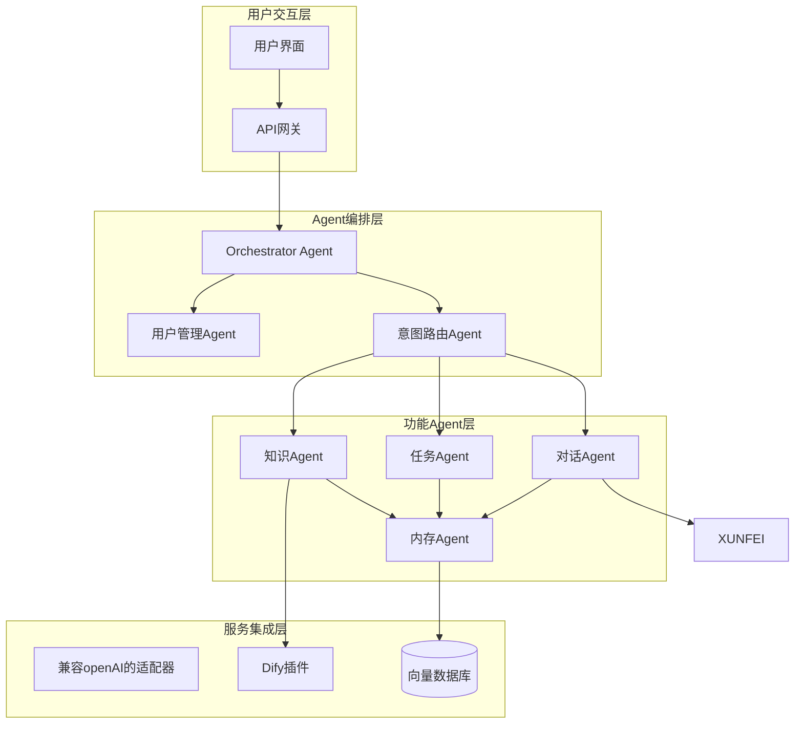
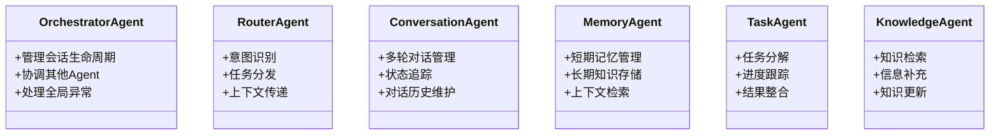
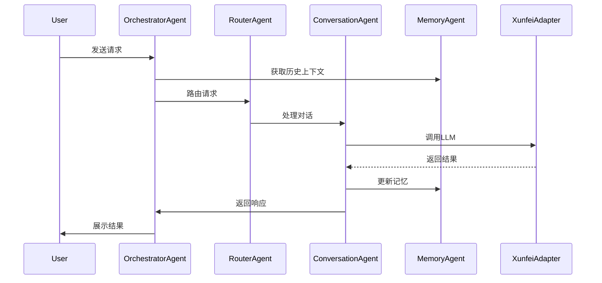
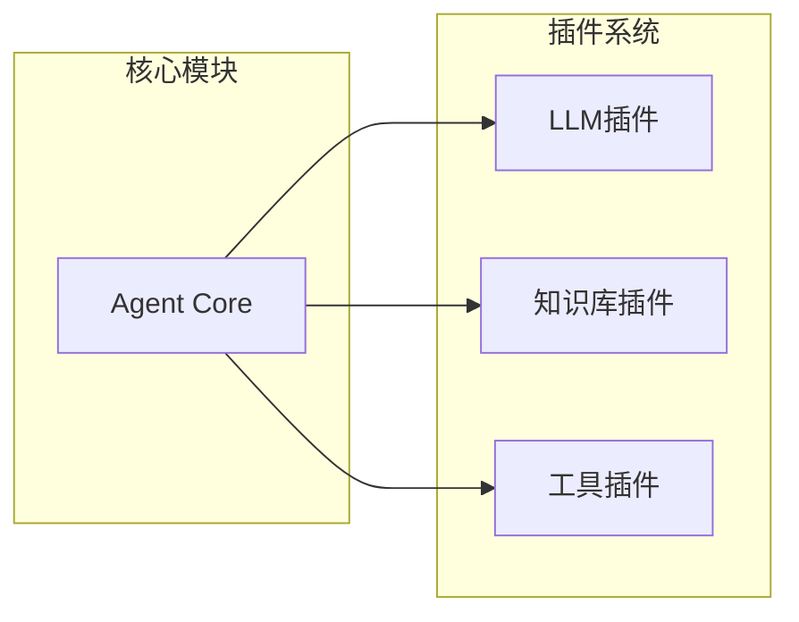

# AutoGen智能体系统架构设计

## 系统架构图



## 核心组件说明



## 数据流说明



## 核心实现说明

### 1. Agent系统设计

#### 1.1 OrchestratorAgent
- 负责管理整个会话的生命周期
- 协调其他Agent的调用顺序
- 处理全局异常和错误恢复
- 维护会话状态和上下文

#### 1.2 RouterAgent
- 基于讯飞API进行意图识别
- 根据意图选择合适的处理Agent
- 传递必要的上下文信息

#### 1.3 专业Agent
- ConversationAgent：处理多轮对话
- TaskAgent：执行具体任务
- KnowledgeAgent：知识检索和更新
- MemoryAgent：管理对话历史和上下文

### 2. 性能优化策略

```python
# 核心配置示例
config = {
    "cache_config": {
        "conversation_cache_size": 1000,  # 对话缓存条数
        "vector_cache_size": 10000      # 向量缓存大小
    },
    "async_config": {
        "max_workers": 10,             # 最大并发工作线程
        "timeout": 2.5                 # 超时时间(秒)
    },
    "batch_config": {
        "max_batch_size": 32,          # 最大批处理大小
        "batch_timeout": 0.1           # 批处理超时(秒)
    }
}
```

### 3. 插件化设计

```python
class BaseAdapter:
    """基础适配器接口"""
    async def initialize(self):
        pass

    async def call_llm(self, prompt: str, **kwargs):
        pass

class XunfeiAdapter(BaseAdapter):
    """讯飞API适配器"""
    pass

class DifyAdapter(BaseAdapter):
    """Dify插件适配器"""
    pass
```

### 4. 扩展性设计



## 下一步实施建议

1. Agent框架搭建
   - 实现基础Agent类
   - 构建Agent间通信机制
   - 开发会话管理功能

2. OpenAI集成
   - 实现API适配器
   - 添加错误重试机制
   - 优化响应处理

3. 性能优化
   - 实现缓存系统
   - 添加并发控制
   - 优化数据流转

4. 插件系统开发
   - 设计插件接口
   - 实现插件加载机制
   - 开发示例插件